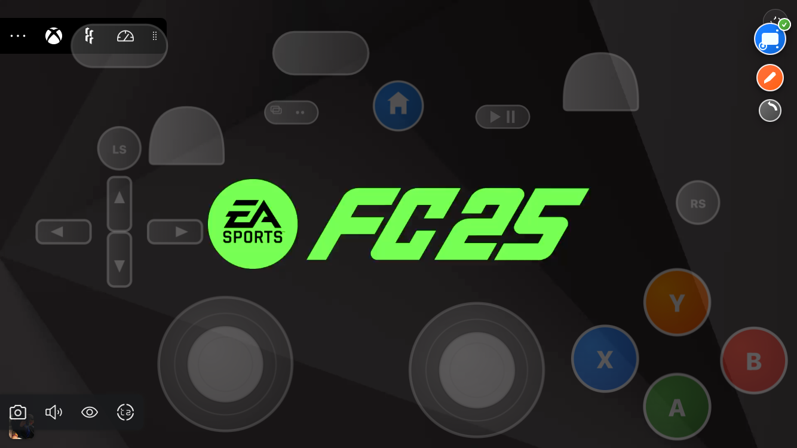

# 🎮 TouchX - XCLOUD

Controle de toque avançado para jogar no **Xbox Cloud Gaming (xCloud)** ☁️  
✅ Suporte a dispositivos móveis 📱  
✅ Compatível com **Tampermonkey / Userscripts** 🐵 

---

## 🚀 Recursos
- 🟨 Feito em **JavaScript** 
- 🎯 Controle de toque totalmente customizável  
- ⚡ Baixa latência e alta performance  
- 🔧 Fácil de instalar e usar  

---

## 🕹️ Interface do Controle

  

---

## 📥 Instalação
1. Instale a extensão [Tampermonkey](https://www.tampermonkey.net/).  
2. Adicione o script [`touchx.user.js`](./touchx.user.js).  
3. Abra o site do **xCloud** e aproveite! 🚀  

---

## 📌 Nota
Este projeto é experimental e feito para melhorar a experiência de jogo no **xCloud**. 🎮 